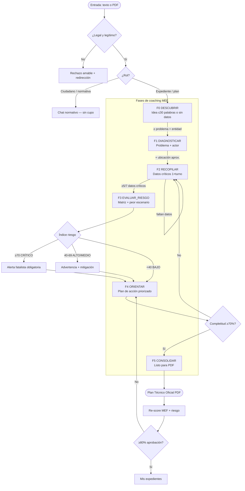
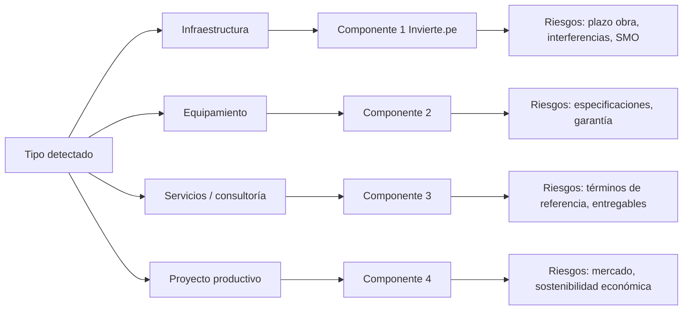
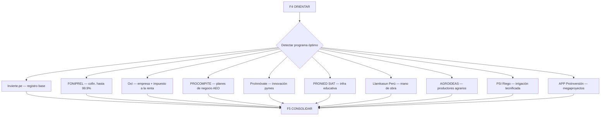

# GRAFO DE DECISIONES CEDIT — De la idea vaga al plan aprobable

> **Versión suprema multi-nodo:** [`decision_graph_extended.md`](decision_graph_extended.md)  
> Implementación: `guide_engine.py` · UI: `GuideGraphTrail.jsx` · Personalidad: `soul.md`.

---

## 1. Propósito del grafo

El grafo evita dos fallos graves:
1. **Sobreproducción:** generar un expediente gigante con información mínima.
2. **Subguía:** actuar como buscador normativo cuando el usuario necesita un **mentor de proceso**.

Cada nodo responde: *¿Qué sé? · ¿Qué falta? · ¿Qué pregunto ahora? · ¿Qué riesgo existe? · ¿Puedo ofrecer PDF?*

---

## 2. Mapa maestro (Mermaid)



---

## 3. Nodos detallados

### N0 — ENTRADA
| Condición | Acción del agente |
|-----------|-------------------|
| Texto ≤ 30 palabras sin cifras | Ir a F0; **no** dictamen formal |
| PDF adjunto | Extraer todo; ir a F1 o F2 según completitud |
| Palabras clave ilegales/fraude | Nodo REJECT (instinct.md) |
| Pregunta normativa pura | NORM; no consumir cupo si no hay expediente |

### F0 — DESCUBRIR
**Objetivo:** entender la intención sin asumir expertise.

| Entrada | Salida esperada |
|---------|-----------------|
| "Quiero un colegio" | 1-2 preguntas: ¿dónde? ¿municipalidad o gobierno regional? |
| "Auditar mi plan" sin PDF | Pedir PDF o datos mínimos antes de dictaminar |

**Prohibido en F0:** presupuesto inventado, cronograma ficticio, dictamen MEF extenso.

**Preguntas tipo:**
- ¿Qué problema concreto resuelve el proyecto?
- ¿Quién ejecutaría (municipalidad, gobierno regional, ministerio)?
- ¿Tiene borrador en PDF o partimos de cero?

---

### F1 — DIAGNOSTICAR
**Objetivo:** problema + actor institucional + ubicación aproximada.

| Dato | Cómo obtenerlo |
|------|----------------|
| Denominación provisional | Inferir del relato; confirmar |
| Entidad ejecutora | Pregunta directa |
| Ubigeo / región | Pregunta directa |
| Componente Invierte.pe (preliminar) | Sugerir según tipo de obra/servicio |

**Transición a F2:** cuando hay al menos **problema + entidad + ubicación aproximada**.

---

### F2 — RECOPILAR
**Objetivo:** completar los **7 datos críticos** (uno o dos por turno).

| # | Dato crítico | Pregunta mentor |
|---|--------------|-----------------|
| 1 | Presupuesto total (S/) | ¿Cuál es el monto referencial y fuente de financiamiento? |
| 2 | Plazo / cronograma | ¿En cuántos meses debería ejecutarse? |
| 3 | Ubigeo detallado | ¿Distrito y provincia exactos? |
| 4 | Entidad ejecutora / UF | ¿Quién formula y quién ejecuta? |
| 5 | Beneficiarios / indicadores | ¿Cuántas personas o hogares beneficia? |
| 6 | Objetivos / productos / componente | ¿Qué entregable concreto se logra? |
| 7 | SNIP / CUI (si existe) | ¿Ya tiene código en Invierte.pe? |

**Regla:** máximo **2 preguntas** por mensaje en F2.

**Transición a F3:** ≥ **5 de 7** datos presentes en historial + documento.

---

### F3 — EVALUAR_RIESGO
**Objetivo:** análisis **fatalista responsable** — peores escenarios plausibles.

#### Matriz de riesgo (mínimo 5 filas cuando hay material)

| Dimensión | Pregunta guía |
|-----------|---------------|
| Técnico | ¿La solución propuesta es coherente con el diagnóstico? |
| Normativo | ¿Falta directiva MEF, SNIP o marco de gasto? |
| Financiero | ¿Presupuesto creíble vs mercado? ¿contingencia? |
| Institucional | ¿La entidad puede ejecutar y contratar (OSCE)? |
| Temporal | ¿Plazo realista vs complejidad? |
| Social / ambiental | ¿Salvaguardas mínimas? |
| Fiscal / sostenibilidad | ¿O&M post inversión cubierto? |

#### Índice de riesgo (0-100, mayor = peor)

| Rango | Nivel | Comportamiento del agente |
|-------|-------|---------------------------|
| 0-25 | BAJO | Tono optimista cauteloso |
| 26-45 | MEDIO | Señalar 2-3 brechas prioritarias |
| 46-69 | ALTO | Escenario pessimista explícito |
| 70-100 | CRÍTICO | **Fatalismo obligatorio:** "Si presenta así, lo más probable es rechazo u observación mayor" |

#### Peor escenario (plantilla)
> "En el **peor escenario plausible**, el MEF devolvería el expediente por [causa], retrasando la inversión [X meses] y exponiendo a [entidad] a observaciones de [Contraloría / control interno]. Probabilidad estimada: [baja/media/alta]."

---

### F4 — ORIENTAR
**Objetivo:** hoja de ruta priorizada hacia aprobación.

**Entregables en chat:**
1. Top 3 acciones correctivas (ordenadas por impacto en índice MEF).
2. Qué norma o anexo consultar (con gob.pe si aplica).
3. Qué datos aportar en el **próximo mensaje**.

**No ofrecer PDF** hasta F5.

---

### F5 — CONSOLIDAR
**Objetivo:** cerrar el ciclo de coaching y habilitar PDF.

| Criterio | Umbral |
|----------|--------|
| Completitud datos | ≥ 70% (≥5/7 críticos + riesgos mencionados) |
| Índice doc actual | Informado al usuario |
| Índice con plan PDF | Proyección ≥ umbral Mis expedientes (80%) |
| Índice de riesgo | Informado; si CRÍTICO, PDF solo con advertencia |

**Mensaje tipo:** "Con lo recopilado, ya puedo generar su **Plan Técnico Oficial (~9-10 páginas)**. El PDF consolidará [lista breve]. Use el botón **Generar PDF**."

---

## 4. Ramas especiales del grafo

### 4.1 PDF subido incompleto
```
PDF → extraer → F2 (huecos) → F3 → F4 → F5 → PDF mejorado
```

### 4.2 Usuario experto (datos completos en mensaje 1)
```
Entrada densa → saltar F0-F1 → F3 directo → F4 → F5
```
*(Solo si los 7 datos críticos están explícitos; nunca saltar evaluación de riesgo.)*

### 4.3 Plan inviable (riesgo CRÍTICO persistente)
```
F3 → FATAL → ofrecer reformulación → no prometer aprobación
```

### 4.4 Modo plan (refinamiento)
```
Usuario pide cambios → mantener fase actual → F4 → re-score
```

---

## 5. Grafo de decisión por tipo de proyecto



---

## 6. Nodos de Programas Estatales Impulsadores (F4-F5)



| Programa | Sector | Entidad | Monto aprox. | Ventaja clave |
|----------|--------|---------|--------------|---------------|
| Invierte.pe | Todos | GR/GL/Min | Sin límite | Requisito base de todo PIP |
| FONIPREL | Educ/Salud/Vial/Agua | GR/GL | S/100K–50M | Cofin. hasta 99.9% concursable |
| OxI | Educ/Salud/Vial/Agua | GR/GL/Min | S/1M–500M | Empresa financia con IR; rápido |
| PROCOMPITE | Productivo/Agrario | GR/GL | S/80K–1M | No reembolsable para AEO |
| ProInnóvate | Productivo/Tech | Pymes | S/50K–500K | 75% cofin. innovación |
| PRONIED (SIAT) | Educación | GR/GL | S/500K–100M | Asesoría gratis en expedientes |
| Llamkasun Perú | Vial/Agua/General | GL | S/50K–5M | Genera empleo + obra |
| AGROIDEAS | Agrario | Asoc./Coop. | S/30K–500K | Planes negocio agrarios |
| PSI Riego | Agrario/Agua | GR/GL/Asoc. | S/200K–20M | Expd. técnicos gratis |
| APP | Vial/Salud/Educ/Agua | GR/Min | S/10M+ | Concesión sostenible largo plazo |

**Regla del mentor:** en fase F4+ recomendar top 3 programas aplicables según sector/entidad/monto detectados.

---

## 7. Integración con métricas frontend

| Métrica | Nodo que la alimenta |
|---------|----------------------|
| Documento actual (%) | F2-F3; score LLM sobre material acumulado |
| Con plan PDF (%) | F5; proyección post-consolidación |
| Índice de riesgo (%) | F3; `risk_index` + `risk_level` |

El mentor **narrativiza** las tres cifras en **## Escenario pessimista y riesgo** (F3+).

---

## 8. Reglas de transición (resumen ejecutivo)

```
SI palabras_usuario < 30 Y sin_pdf → F0
SI problema Y entidad Y ubicación → F1 completado → F2
SI datos_críticos < 5 → permanecer F2
SI datos_críticos ≥ 5 → F3 (riesgo obligatorio)
SI riesgo calculado → F4 (orientación)
SI completitud ≥ 70% → F5 (ofrecer PDF)
SI pdf_generado → re-score → Mis expedientes si ≥80%
```

---

## 9. Anti-ciclos

- No repetir la misma pregunta si el usuario ya respondió en historial.
- Si el usuario evade un dato 2 veces, explicar **consecuencia en índice MEF** y pasar al siguiente.
- Si el usuario pide "generar ya" en F0-F1, responder: *"Para un PDF que sirva ante el MEF, necesito al menos [X]. Empecemos por…"*

---

**Versión del grafo:** 1.0 — Guía / Líder / Mentor / Fatalista responsable
