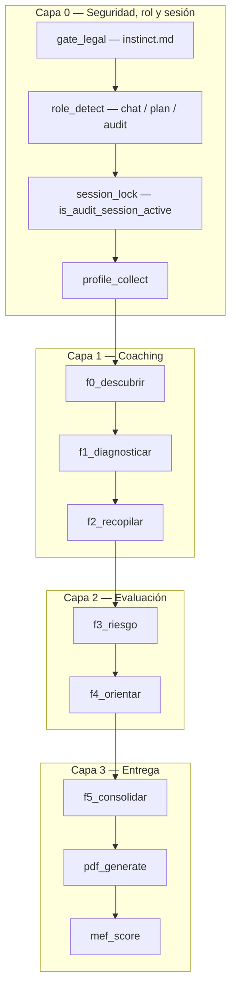
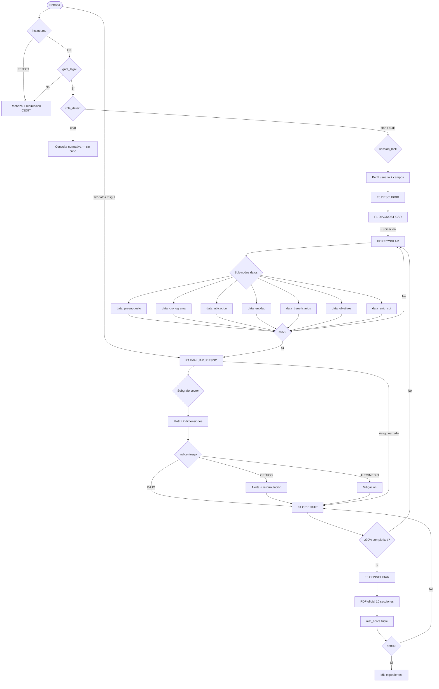
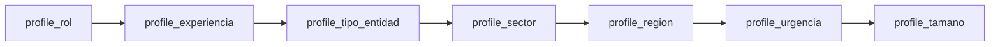
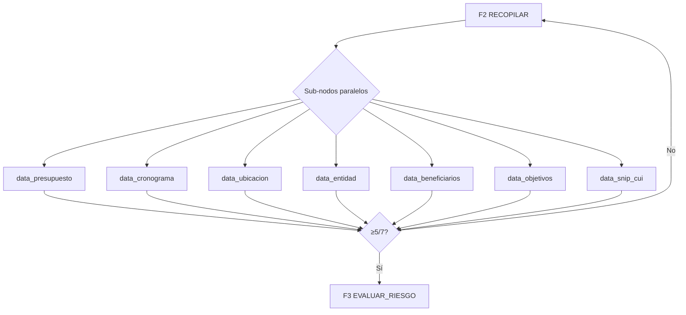
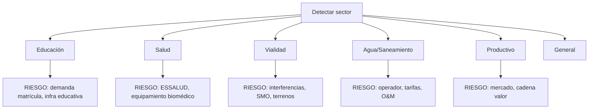
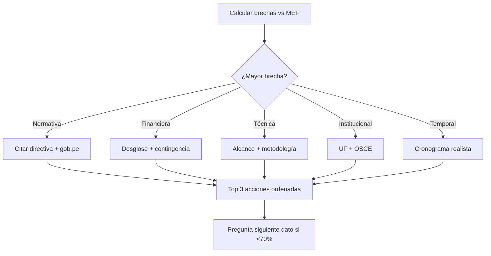
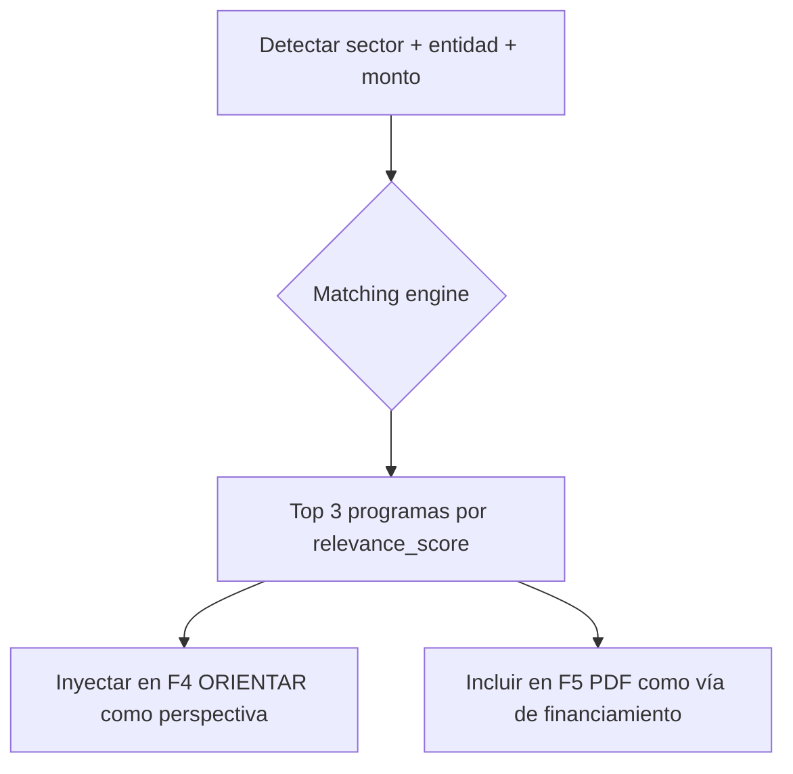

# GRAFO DE DECISIONES EXTENDED — Arquitectura Suprema CEDIT

> **Raíces de enrutamiento:** [`decision_roots.md`](decision_roots.md)  
> Resumen F0–F5: `decision_graph.md` · Motor: `guide_engine.py` · Visualización UI: `GuideGraphTrail.jsx`

---

## 1. Arquitectura de capas



| Capa | Nodos | Función |
|------|-------|---------|
| 0 | legal, rol, sesión, perfil | Elegibilidad, modo, persistencia de mentoría, contexto humano |
| 1 | F0–F2 | Recopilación sin sobreproducción |
| 2 | F3–F4 | Riesgo fatalista + ruta de mejora |
| 3 | F5–PDF–score | Consolidación y métricas |

---

## 2. Grafo maestro expandido



---

## 3. Nodo L0C — Perfil de usuario (detalle)



| ID perfil | Si falta, preguntar cuando |
|-----------|----------------------------|
| rol | F0 o F1 |
| experiencia_mef | F0 |
| tipo_entidad | F1 |
| sector | F1 (define subgrafo) |
| region | F1 |
| urgencia | F2 |
| tamano_proyecto | F2 (junto presupuesto) |

**Visualización UI:** chips verdes = recopilado; gris = pendiente; ámbar = foco activo.

---

## 4. Nodo F2 — Subgrafo de datos críticos (paralelo)

Cada sub-nodo `data_*` es un **hueco independiente**. El motor marca **uno** como `active` (primer dato faltante no evadido dos veces):



**Regla de oro:** el LLM pregunta solo el sub-nodo marcado `active` en `guide_graph.nodes_active`. Máximo **2 preguntas** por turno. Si el usuario evade un dato **2 veces**, el foco pasa al siguiente hueco (`evaded_topics` en estado).

---

## 5. Subgrafo sectorial (F3)



---

## 6. Subgrafo fatalista (F3 — obligatorio)

| Nivel riesgo | Índice | Acción del mentor |
|--------------|--------|-------------------|
| BAJO | 0-25 | Optimismo cauteloso |
| MEDIO | 26-45 | 2-3 brechas prioritarias |
| ALTO | 46-69 | Peor escenario explícito |
| CRÍTICO | 70-100 | Rechazo probable; reformular antes de PDF |

**Elementos mínimos del bloque chat:**
1. Al menos **5 riesgos** en matriz (probabilidad × impacto).
2. **1 peor escenario narrativo** (3-5 líneas).
3. **Probabilidad cualitativa** de rechazo (baja/media/alta).
4. **2 mitigaciones** accionables.

---

## 7. Nodo F4 — Árbol de orientación



---

## 8. Nodo F5 + PDF — Pipeline de consolidación

| Paso | Sistema | Salida |
|------|---------|--------|
| 1 | `assess_guide_state` pdf_ready=true | Habilitar botón UI |
| 2 | `_build_conversation_digest` | Contexto unificado |
| 3 | `_generate_pdf_sections_chunked` ×10 | Secciones MEF |
| 4 | `CEDITPdf` | Archivo formal |
| 5 | `score_document_against_mef` | Triple índice + riesgo |
| 6 | ≥80% | `Mis expedientes` |

---

## 9. Trazabilidad y visualización (API → UI)

Cada respuesta de auditoría incluye `guide_graph`:

```json
{
  "current_node_id": "f2_recopilar",
  "phase_name": "RECOPILAR",
  "role_mode": "plan",
  "session_locked": false,
  "legal_gate": "passed",
  "expert_fast_path": false,
  "focus_data_id": "presupuesto",
  "evaded_topics": [],
  "nodes": [{ "id": "f0_descubrir", "status": "completed", "label": "Descubrir", "icon": "explore" }],
  "critical_items": [{ "id": "presupuesto", "collected": false }],
  "profile": { "completeness_pct": 42, "items": [] },
  "trail": ["gate_legal", "role_detect", "f0_descubrir", "f1_diagnosticar", "f2_recopilar"],
  "mentor_message": "Recopilando expediente pieza a pieza..."
}
```

**Estados visuales:**
- `completed` — azul, nodo superado
- `current` — ámbar pulsante, foco del turno
- `active` — sub-nodo en progreso (ej. data_presupuesto)
- `pending` — gris, aún no alcanzado

---

## 10. Matriz de transición (tabla completa)

Ver también [`decision_roots.md`](decision_roots.md) §3–§4.

| Desde | Condición | Hacia |
|-------|-----------|-------|
| START | instinct / ilícito / código | REJ |
| START | `detect_input_mode` = chat | NORM |
| START | `is_audit_session_active` | Grafo (session_lock) |
| START | texto ≤30 palabras, sin PDF | F0 |
| START | PDF adjunto | F1 o F2 según extracción |
| START | 7/7 datos, sin turno previo asistente | F3 (fast path) |
| F0 | problema + actor | F1 |
| F1 | + ubicación aproximada | F2 |
| F2 | dato i incompleto, no evadido 2× | F2 (`data_i` active) |
| F2 | dato i evadido 2× | F2 (`data_j` siguiente) |
| F2 | ≥5/7 datos | F3 |
| F3 | sin bloque riesgo en historial asistente | F3 |
| F3 | riesgo narrado | F4 |
| F4 | completitud <70% | F2 |
| F4 | completitud ≥70%, orientación en historial | F5 |
| F5 | usuario confirma / pdf_ready | PDF |
| PDF | score <80% | F4 |
| PDF | score ≥80% | Mis expedientes |

### 10.1 Turnos posteriores (señales del usuario)

| Señal | Hacia | Notas |
|-------|-------|-------|
| Responde dato pedido | Fase actual / siguiente `data_*` | Validar + 1 pregunta |
| "Generar PDF ya" en F0–F2 | Anti-ciclo | Explicar umbral mínimo |
| Cambio a normativa en sesión activa | Mantener grafo | `session_lock` |
| PDF mid-chat | F1 o F2 | Extraer sin reiniciar F0 |
| Corrección monto/plazo | F2 o re-F3 | Re-evaluar riesgo si aplica |
| Refinamiento plan | F4 | Re-score |

---

## 11. Casos especiales (multi-rama)

### 11.1 Usuario experto — entrada densa
Saltar F0–F1 si: **7/7 datos explícitos** en un mensaje sin respuesta previa del asistente → **F3 directo** (nunca saltar riesgo). Implementado en `assess_guide_state(..., expert_fast_path)`.

### 11.1b Sesión mentoría persistente
Si `is_audit_session_active(session_mode, history)` es verdadero, **todos los mensajes** siguientes activan el grafo y consumen cupo aunque el texto no mencione expediente. Reflejado en `guide_graph.session_locked` y nodo `session_lock`.

### 11.2 Urgencia CRÍTICA (perfil)
Priorizar checklist mínimo viable; advertir calidad insuficiente si aplica.

### 11.3 Municipio pequeño + proyecto grande
Riesgo institucional ALTO por capacidad; nodo F3 enfatiza UF y asistencia técnica.

### 11.4 Proyecto productivo
Activar subgrafo PRO; riesgo de mercado y sostenibilidad económica.

### 11.5 Segunda vuelta post-PDF
Re-score → si bajó índice, F4 con brechas del PDF generado.

---

## 12. Sincronización con archivos MD

| Archivo | Rol en el grafo |
|---------|-----------------|
| `decision_roots.md` | Árbol L0 + matriz primer contacto y turnos 2+ |
| `master.md` | Gates legales L0A + identidad primer turno |
| `instinct.md` | Rama REJ (pre-gate) |
| `soul_extended.md` | Conducta por fase |
| `plan.md` | Orquestación omnicanal |
| `guide_engine.py` | Estado machine ejecutable |

---

## 13. Nodos de Programas Estatales Impulsadores

A partir de F1 (cuando se detecta sector), el motor identifica programas estatales aplicables:



**Programas modelados (10):**
| ID | Programa | Aplicabilidad |
|----|----------|---------------|
| prog_invierte | Invierte.pe (MEF) | Todo PIP — requisito base |
| prog_foniprel | FONIPREL | GR/GL, cofin. concursable hasta 99.9% |
| prog_oxi | Obras por Impuestos | Empresa privada + obra pública |
| prog_procompite | PROCOMPITE | Planes de negocio productivos |
| prog_proinnovate | ProInnóvate | Pymes innovadoras |
| prog_pronied | PRONIED (SIAT) | Infraestructura educativa |
| prog_trabaja_peru | Llamkasun Perú | Obras intensivas mano de obra |
| prog_agroideas | AGROIDEAS | Productores agrarios organizados |
| prog_riego | PSI Riego | Irrigación tecnificada |
| prog_app | APP (ProInversión) | Megaproyectos concesión |

**Comportamiento del mentor:**
- F1-F2: menciona programa más relevante como "perspectiva" ("Ojo, si es educación, PRONIED da asesoría gratis para expedientes")
- F4: sección formal `## Programas impulsadores recomendados` con top 3
- F5/PDF: integra recomendación de financiamiento en el plan técnico

**Visualización frontend:** `recommended_programs` en `guide_graph` JSON, renderizado en `GuideGraphTrail.jsx`.

---

## 14. Red de decisiones interactiva (UI — solo auditoría)

Cuando `isAuditSession` es verdadero, cada respuesta del bot con `guide_graph` crea un **checkpoint** (`decisionCheckpoints`):

| Campo | Uso |
|-------|-----|
| `messageIndex` | Índice del mensaje bot en el chat |
| `phase` / `nodeId` | Fase y nodo del grafo MEF |
| `userPrompt` | Última pregunta del usuario antes de esa respuesta |
| `guideGraph` | Snapshot slim del estado |

**Componente:** `AuditDecisionNetwork.jsx`
- Nodos **arrastrables** (posiciones en `nodePositions`)
- Conexiones curvas estilo red neuronal (timeline + laterales)
- Botón **Restaurar chat aquí** → trunca mensajes y checkpoints posteriores
- Visible **solo en auditoría/plan**, no en consulta normativa ciudadana

**Restaurar:** confirma al usuario; `messages.slice(0, messageIndex + 1)`; la siguiente pregunta usa historial truncado hacia la API.

---

## 15. Evolución futura (grafo v4)

- Persistencia de `guide_graph` por `conversationId` en backend.
- Historial de nodos visitados en sidebar.
- Export PNG del recorrido para informes UF.
- Grafo condicional por normativa regional.

---

**Versión:** 4.0 — Raíces unificadas + motor v4 · **Nodos totales:** 13 principales + 7 datos + 7 perfil + 5 sectores + 10 programas
