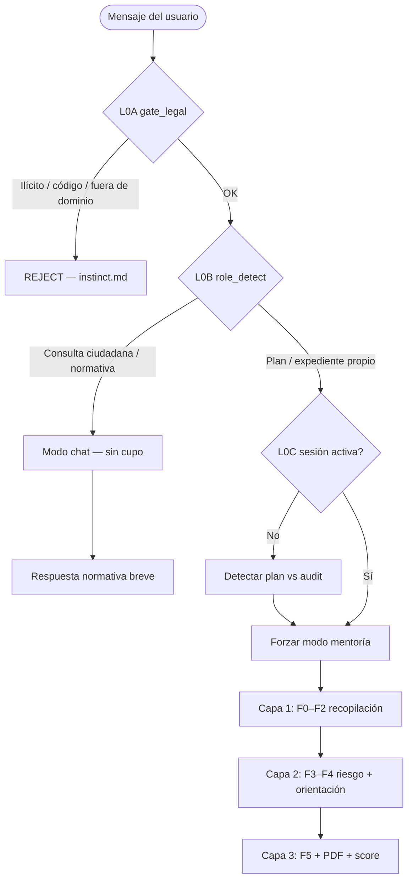

# RAÍCES DE DECISIÓN CEDIT — Del mensaje del usuario al nodo activo

> **Documento maestro de enrutamiento.** Resume cómo cada mensaje (primer contacto y turnos siguientes) activa el grafo.  
> Detalle de fases F0–F5: [`decision_graph.md`](decision_graph.md) · Especificación extendida: [`decision_graph_extended.md`](decision_graph_extended.md) · Motor: `guide_engine.py` · Modo/cupo: `cedit_core.py`.

---

## 1. Capas de decisión (orden obligatorio)

Cada mensaje del usuario atraviesa **cuatro capas** antes de generar la respuesta. Si una capa corta el flujo, las inferiores no se ejecutan.

| Capa | Nodo(s) | Fuente | Qué decide |
|------|---------|--------|------------|
| **L0A** | `gate_legal` | `instinct.md` + `is_illicit_or_harmful()` / `is_technical_code_or_error()` | ¿Continuar o rechazar amablemente? |
| **L0B** | `role_detect` | `cedit_core.detect_input_mode()` | `chat` (NORM) vs `plan` vs `audit` |
| **L0C** | `session_lock` | `is_audit_session_active()` | Si ya hubo mentoría, **todos** los turnos siguientes usan grafo y cupo |
| **L1–L3** | `f0`…`f5` | `guide_engine.assess_guide_state()` | Fase de coaching según datos acumulados + historial |

---

## 2. Primer contacto — reglas unificadas

### 2.1 Presentación (identidad)

| Situación | Conducta |
|-----------|----------|
| Saludo vacío ("hola", "buenas") | **No** presentarse como CEDIT. Respuesta natural breve (2–3 oraciones) y pregunta abierta. |
| Pregunta concreta desde el inicio | Responder al contenido; sin presentación institucional. |
| Preguntan "¿quién eres?" | Presentación **una vez**, breve, en el idioma activo. |
| Turnos siguientes | **Prohibido** repetir presentación larga (`master.md`, `cedit_core.CEDIT_IDENTITY_ONGOING`). |

### 2.2 Enrutamiento del primer mensaje

| Entrada del usuario | L0B modo | Grafo F0–F5 | Cupo |
|---------------------|----------|-------------|------|
| "hola" | `chat` | No activa | No |
| "¿cuánto demora un trámite en SUNARP?" | `chat` | No activa | No |
| "Quiero un colegio" | `plan` | F0 DESCUBRIR | Sí |
| "Auditar mi plan" + PDF | `audit` | F1 o F2 según extracción | Sí |
| Mensaje denso con 7/7 datos críticos explícitos | `plan`/`audit` | **Fast path → F3** (nunca saltar riesgo) | Sí |
| Fraude / soborno / código fuente | REJECT | No activa | No |

---

## 3. Transiciones F0 → F5 (criterios ejecutables)

| Desde | Condición (texto acumulado + historial) | Hacia |
|-------|----------------------------------------|-------|
| **F0** | Texto ≤30 palabras **sin** problema+actor | F0 |
| **F0** | problema + actor (aunque sea breve) | F1 |
| **START** | PDF adjunto | F1 o F2 (según extracción) |
| **START** | 7/7 datos críticos en primer mensaje, sin turno previo del asistente | F3 (fast path) |
| **F0** | Señal de problema **y** actor institucional | F1 |
| **F1** | + ubicación aproximada (región/distrito/departamento) | F2 |
| **F2** | Sub-nodo `data_*` incompleto | F2 (foco en siguiente hueco) |
| **F2** | ≥5/7 datos críticos | F3 |
| **F3** | Matriz de riesgo aún no en historial del asistente | F3 |
| **F3** | Riesgo narrado en historial | F4 |
| **F4** | Completitud &lt;70% | F2 (rellenar huecos) |
| **F4** | Completitud ≥70%, orientación en historial | F5 |
| **F5** | Usuario confirma / `pdf_ready` | PDF → re-score |
| **PDF** | Score &lt;80% | F4 |
| **PDF** | Score ≥80% | Mis expedientes |

**Nota F2:** Los 7 sub-nodos `data_*` son **paralelos**; el motor marca uno como `active` (primer hueco no evadido). No hay orden fijo obligatorio.

**Nota F3→F4:** La evaluación de riesgo es obligatoria una vez hay ≥5/7 datos. El avance a F4 se confirma por marcadores en respuestas previas del asistente (`## Escenario pessimista`, matriz de riesgo, etc.).

---

## 4. Turnos posteriores — matriz de conducta

| Señal del usuario | Nodo / acción | Conducta del mentor |
|-------------------|---------------|---------------------|
| Responde el dato pedido | Mantener fase; avanzar sub-nodo F2 | Validar, narrar avance, 1 pregunta siguiente |
| Evade el mismo dato **2 veces** | Saltar al siguiente `data_*` | Explicar consecuencia en índice MEF; no repetir pregunta |
| "Generar PDF ya" en F0–F2 | Anti-ciclo | *"Para un PDF útil ante el MEF necesito al menos [X]. Empecemos por…"* |
| Cambia de tema (normativa genérica) en sesión activa | `session_lock` | Mantener mentoría si `is_audit_session_active`; no perder expediente |
| Adjunta PDF a mitad de chat | F1 o F2 | Extraer; rellenar huecos; no reiniciar F0 |
| Corrige un dato (monto, plazo) | Fase actual o F2 | Actualizar checklist; re-evaluar riesgo si cambia presupuesto/plazo |
| Pide refinamiento del plan | F4 | Re-score; mantener historial |
| Insultos / agresión | `instinct` §1 | Ignorar insulto; responder solo parte técnica |
| Ilícito / fraude | `gate_legal` → REJ | Rechazo amable + redirección (`instinct` §2) |

---

## 5. Casos de prueba narrativos (QA del grafo)

| # | Entrada | Resultado esperado |
|---|---------|-------------------|
| 1 | `"hola"` | chat, sin grafo, sin presentación larga |
| 2 | `"¿Qué es el silencio administrativo?"` | NORM, sin cupo |
| 3 | `"Quiero un colegio"` | plan, F0, 1 pregunta (¿dónde? / ¿quién ejecuta?) |
| 4 | `"Colegio en Cusco, municipalidad Wanchaq, S/2M, 18 meses, 500 alumnos, obra componente 1, sin SNIP"` | fast path F3 |
| 5 | PDF incompleto subido | F2 huecos → F3 → F4 |
| 6 | Turno 3: usuario ignora presupuesto 2 veces | F2 foco en cronograma + nota de consecuencia |
| 7 | Sesión audit activa + "¿y la ley de contrataciones?" | Mentoría continúa; respuesta breve normativa + retoma expediente |
| 8 | `"generar PDF"` con 2/7 datos | Anti-ciclo; no ofrecer botón |
| 9 | Completitud 71% (5/7) tras riesgo + orientación | F5, invitar PDF |
| 10 | Post-PDF score 65% | F4 con brechas del PDF |

---

## 6. Sincronización con archivos

| Archivo | Rol en raíces |
|---------|---------------|
| `master.md` | Identidad y primer turno |
| `instinct.md` | Pre-gates L0A (REJECT) |
| `plan.md` | Orquestación por turno |
| `decision_graph.md` | Fases F0–F5 resumidas |
| `decision_graph_extended.md` | Subgrafos, UI, programas |
| `soul.md` | Conducta y tono por fase |
| `guide_engine.py` | Estado ejecutable + `guide_graph` JSON |
| `cedit_core.py` | Modo, cupo, sesión, identidad runtime |

---

**Versión:** 1.0 — Raíces unificadas · Alineado con motor v4
